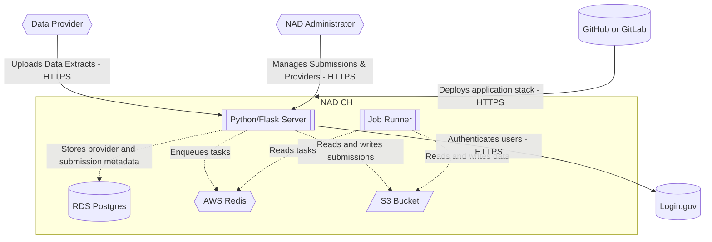

# National Address Database Submission Tool Architecture

### Entry Points

Users can work with the National Address Database Submission Tool by way of:

- **Flask Web Server**: Primary interface for web-based interactions for Data
  Producers and NAD Administrator.
- **CLI**: Command line interface allowing NAD Administrator to perform
  administrative tasks.

### Application Core

Logic concerning business rules, data validation and profiling, and other
application concerns. The core is unaware of how its entry points and its
infrastructure dependencies are implemented.

### Infrastructure Dependencies

The current remote development environment uses [services provided by cloud.gov](https://cloud.gov/docs/services/intro/).

- **Object Storage**: Storage for datasets submitted by users, via
  [S3](https://cloud.gov/docs/services/s3/).
- **Relational Database**: Persistence for application data and data validation
  reports, via [RDS PostgreSQL database](https://cloud.gov/docs/services/relational-database/).
- **Task Queue Broker**: Manages queue of data validation tasks for Celery, via
  [AWS Elasticache Redis](https://cloud.gov/docs/services/aws-elasticache/).

### System diagram

